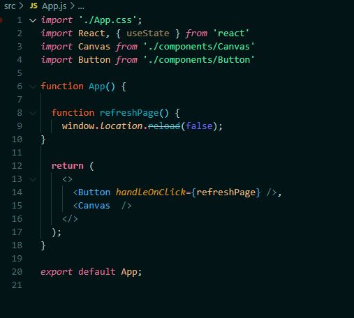
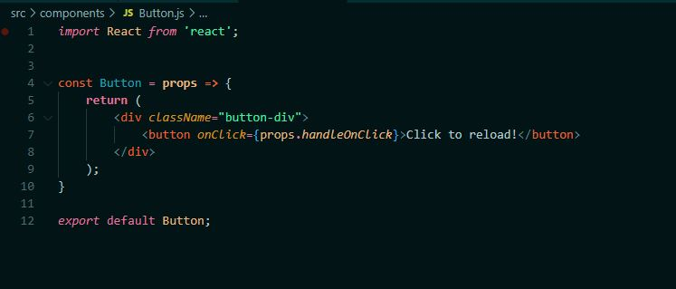
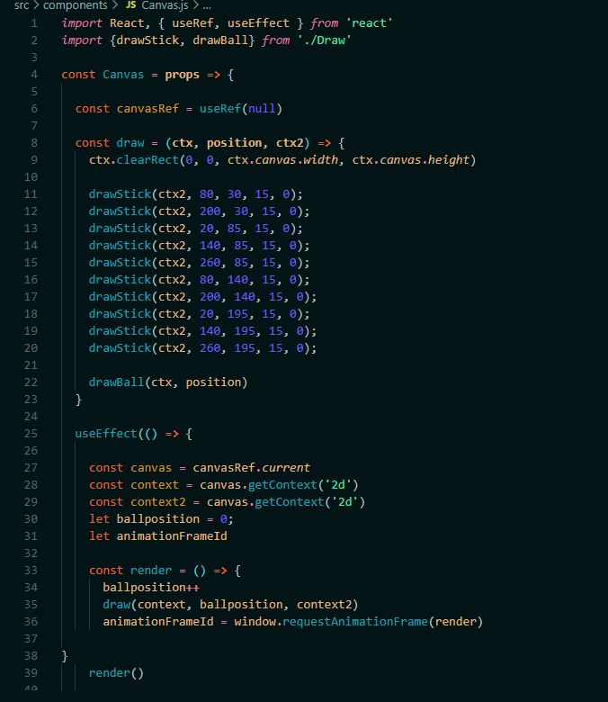
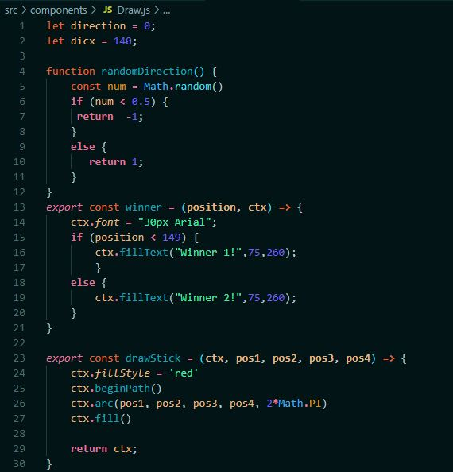
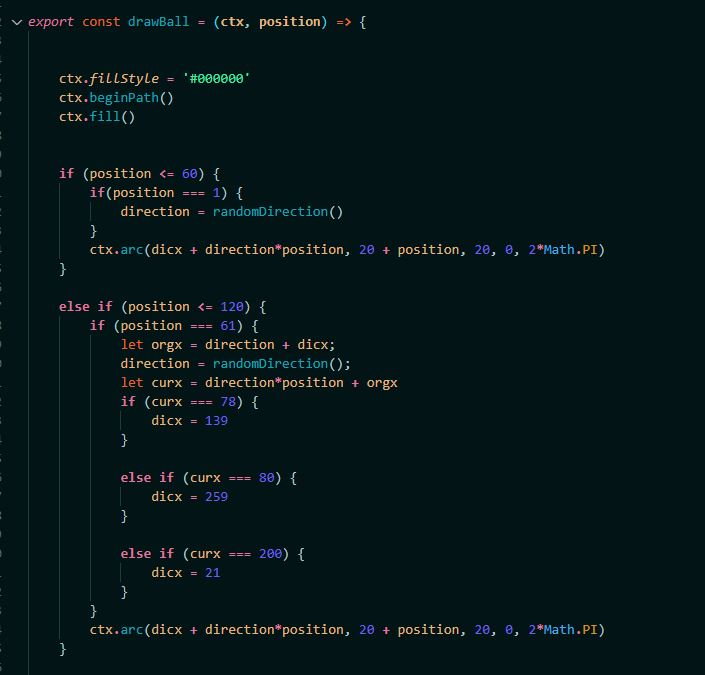
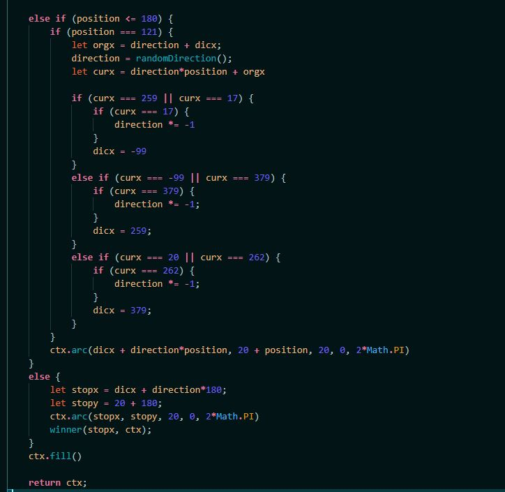
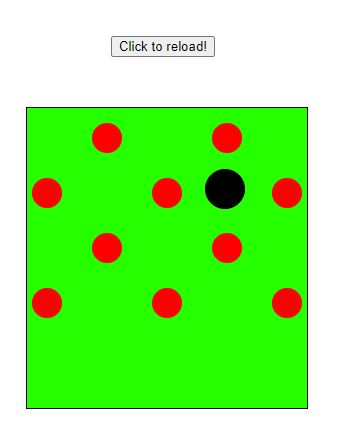
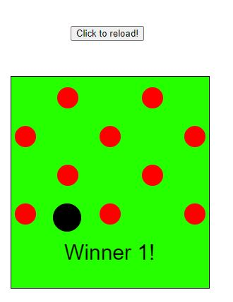

# Web-ohjelmointi TTMS0500-3004
## Harjoitustyö Arpa
## Tomi Hyvärinen
## Pvm.5.12.2020

### School project rngball
This school project made whit react. Drop a ball and ball goin to 1 or 2 position, wich position ball goin win. Very simple project planned to doing bigger but time was running out. [Dropaball](https://ainimarie.github.io/webharkka)

### Linkit
Ohjelma näkyvissä https://ainimarie.github.io/webharkka
(Jouduin lainaamaan vaimoni githubia kun en samoilla käskyillä saanut omaani toimimaan, en tiedä miksi. Käytetty gh-pages-moduulia, ohjeet katsottu https://www.npmjs.com/package/gh-pages)
Lähdekoodit nähtävissä: https://github.com/tjhyva/webharkka/tree/master/src

### Suunnitelma
Suunnitelmissa oli toteuttaa Reactilla canvasin avulla pallon pudotus-peli joka arpoo kumpaan suuntaa pallo menee ja kumpi voittaa. Reactin käytöstä ei ollut paljon kokemusta, joten otin vähän helpomman porojektin työn alle oppimistarkoituksella.

### Toteutus

Työ alkoi React-projektin asentamisella. Käyttöympäristönä toimi localhost.

Toteutus alkoi paperisella suunnitelmalla (helppo kehittää eteennpäin tarvittaessa), tämä on itselleni helpoin tapa hahmottaa mitä tulen tarvitsemaan työhöni. Tämä on toiminut minulle monessa projektissa, toki pari lisäystä tuli vielä matkan varrella.

### Sovellus

Ensin siivosin Reactin mukana tulevat ylimääräiset ohjelmapätkät. Seuraavaksi oli pallon piirron aika, loin components kansion jonne lisäsin Canvas-komponentin, tämä kestikin vähän pidempään (ongelmia exporttien kanssa). Vidoinkin sain pallon näkyviin ja suunnittelemaan pallon liikkeitä, tämä onneksi meni paljon nopeammin. Sitten oli työläin homma: pallon liikuttelu Math.Randomin avulla, miten muutan suuntaa ja miten muutan suuntaa seuraavassa risteys-kohdassa että arpoo uuden suunnan. Tässä hommassa kesti arviolta kahdeksan tuntia, että sain pallon suunnan arvottua ja pallon liikkeelle tietyn matkaa oikeaan suuntaan. Mutta voittajana maaliin :) (Tämän olisi voinut toteuttaa paljon helpomminkin näin jälkeen päin ajateltuna...) Tässä välissä siistin vähän koodia ja tein Draw-komponentin jotta saisin canvasin piirtämisen omalle komponentille. Seuraavaksi oli vuorossa Button, joka päivittää sivun ja aloittaa uuden kierroksen: loin Button-komponentin jonka avulla sain sivun päivittymään. Tämän jälkeen loin pallon pysäytyksen, tässä ei kestänyt enää kauan (ohjelma rullaa koko ajan, tämä on huono puoli tässä). Viimeisenä loin voittajan ilmoittamisen Canvasin avulla: tämä oli helpoin koko projektissa.

### Functioiden käyttöä

#### App

Importit näyttävät mistä tietoa haetaan, return käyttää Button-elementtiä components/Button luokan avulla joka päivittää sivun. Canvas hakee piirrustukset Canvas-komponentistä.

Button-komponentillä on handle.OnClick-funktio joka tarkkailee milloin buttonia painetaan, ja välittää tiedon App-komponentille.

Draw-funktiolle välitetään tietoa piirustuksen 2d-mallista, mikä pallon position on sillä hetkellä, ja toisen piirrustuksen 2d-mallista. DrawStick-funktio välittää palkin paikan Drawstick-funktiolle joka on Draw-komponentissä, drawball välittää samaan paikkaa pallon sen hetkiset tiedot. UseEffectistä haetaan alkuperäiset tiedot muuttujiin, renderiä käytettää draw-funktiota joka välitää tietoa pallon kontekstistä, pallonsijainnista ja palkkien kontekstistä.

Retunn luo canvas-elementin, määrittää sen koon ja välittää tietoa App:iin jolla piirretään kuvat.

Funktio randomDirection arpoo, onko lukema alle 0.5 vai 0.51-1 jolloin jolla palautetaan suunta joko 1 tai -1. Winner-funktio piirtää paikan perusteella onko 1 vai 2 voittaja. DrawStick ottaa vastaan palkkien ominaiseuuden ja paikan, jolla esteet piirretään ja palauttaa piirrettävät kuvat.

DrawBall luo pallon: tässä katsotaan y-akselin positionia, jolla siirrytään uudestaan arvontaan ja tuleeko RandomDirectionista + vai -: tällä kerrotaan positionia ja se määrää suunnan eteenpäin. Tätä jatkuu, kunnes saavutaan 180 y-akselin positionin pisteeseen, jolloin pallon liikkuminen pysäytetään. (Tätä laskutoimitusta olisi pitänyt käyttää pallon suuntaamisessakin).

### Käyttöliitymästä kuvia

### Arviointi

Mielestäni ihan siisti kokonaisuus kokemukseen nähden. Parannettavaa tosin tässä projektissa jäi, olisin halunnut pysäyttää canvasin piirtämisen ja vielä API:lla hakea vitsin sovellukseen aina kun pallo on pohjalla :) 
Aikaa meni työhön noin 20h
Arviointi 2.5-3 / 5

